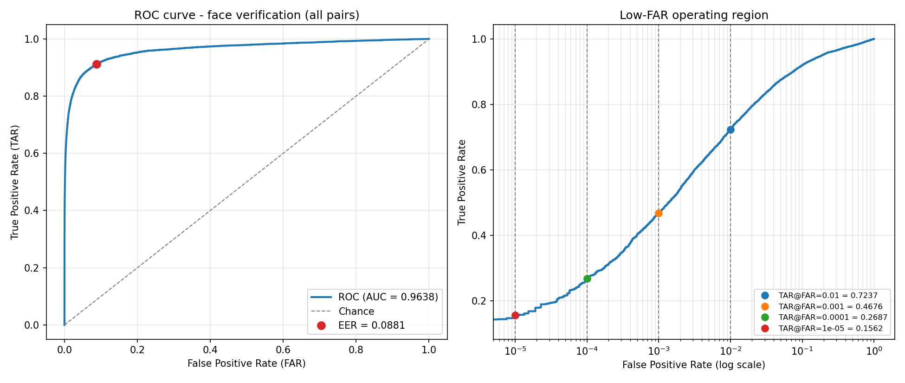
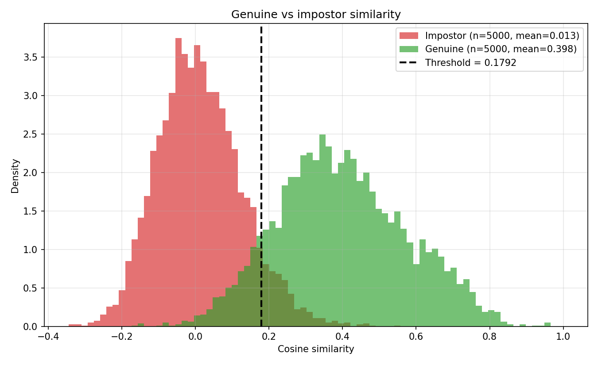

# Face Verification / Re-Identification

A face verification and re-identification pipeline built on a ResNet50 embedding
model. Given two face images it answers *"are these the same person?"* using
cosine similarity between 512-D L2-normalised embeddings, and it identifies a
face against an enrolled gallery.

The ArcFace head and batch-hard triplet loss are implemented from scratch. No
packaged face-recognition library (`face_recognition`, `deepface`, `insightface`,
`facenet-pytorch`) is used — the only pretrained component is the ImageNet
ResNet50 backbone.

## Links

| | |
|---|---|
| **Live demo** | <https://face-verification-resnet50-mainiyash.streamlit.app> — verify two photos, or identify a probe against a built-in 120-identity gallery |
| **REST API** | FastAPI service in [`demo/api.py`](demo/api.py) — `/verify`, `/identify`, `/health`, interactive docs at `/docs` |
| **Model weights** | [huggingface.co/yashMaini/face-verification-resnet50](https://huggingface.co/yashMaini/face-verification-resnet50) |
| **Technical report** | [`submission/report.pdf`](submission/report.pdf) |
| **Metrics summary (txt)** | [`submission/results/metrics_summary.txt`](submission/results/metrics_summary.txt) — every number in one plain-text file |

## Results

Measured on **120 identities that never appear in training** (LFW, identity-disjoint split).

| | |
|---|---|
| ROC-AUC | **0.9587** |
| Equal Error Rate | 9.61% |
| Verification accuracy | 90.60% at threshold **0.1838** |
| Rank-1 / Rank-5 | **64.00%** / 85.62% (chance 0.83%) |
| TAR @ FAR = 1% | 72.76% |
| Open-set DIR @ FPIR = 1% | 28.62% |

<p align="center">
  <br>
  <sub>ROC over all 530,965 test pairs. The right panel resolves down to FAR = 10⁻⁵.</sub><br><br>
  <br>
  <sub>Genuine vs impostor cosine similarity, with the 0.1838 decision threshold.</sub>
</p>

### Cross-dataset: LFW vs MLFW

Same checkpoint, same threshold, same balanced pairing protocol on both datasets,
so the gap is the mask and nothing else. MLFW is restricted to the 1,779
identities absent from training — 40.3% of its identities overlap the training
split, because MLFW derives from CALFW which derives from LFW.

| Dataset | ROC-AUC | EER | TAR @ FAR 1% |
|---|---|---|---|
| **LFW** (unmasked) | **0.9587** | 9.61% | 72.76% |
| **MLFW** (masked) | **0.8388** | 24.58% | 35.36% |
| cost of the mask | −0.1199 | +14.97 pp | −37.40 pp |

<p align="center">
  <br>
  <sub>One model, one protocol, two datasets. A mask costs ~11 AUC points but
  roughly halves usable performance at a 1% false-accept rate. The low-FAR panel scores every pair (523k impostor pairs for LFW, 16.7M for MLFW) rather than a 5,000-pair sample.</sub>
</p>

On MLFW's *official* 6,000-pair protocol the model scores AUC 0.5537 — near
chance. That protocol is adversarial by design (same identity in different masks,
different identities in the same mask, on top of CALFW's cross-age gap) and this
model never saw a masked face in training. Filtering the leaked identities barely
changes it (0.5465), which confirms the difficulty is the protocol rather than
the overlap. Full discussion in
[`submission/README.md`](submission/README.md#8-results).

### Low-FAR operating points

The 5,000 + 5,000 evaluation set the assessment specifies cannot resolve a
false-accept rate below 1/5000 = 2×10⁻⁴. Scoring **every** test pair instead —
all 530,965, of which 523,104 are impostors — pushes the measurement floor to
1.9×10⁻⁶:

| FAR | TAR | impostor pairs behind it |
|---|---|---|
| 10⁻² | 72.37% | 5,231 |
| 10⁻³ | **46.76%** | 523 |
| 10⁻⁴ | 26.87% | 52 |
| 10⁻⁵ | 15.62% | 5 — a plot endpoint, not a reliable measurement |

Every pair the system gets wrong is listed out: [`false_accepts.csv`](submission/results/false_accepts.csv) — 369 impostor pairs accepted at the threshold, **7.38% FAR** — and [`false_rejects.csv`](submission/results/false_rejects.csv) — 571 genuine pairs rejected, **11.42% FRR** — both with real identity names, scores and margins, plus montages of the worst cases in `submission/results/`.

AUC 0.9638 and EER 8.81% on all pairs, within 0.001 and 0.06 points of the
sampled protocol — so the round-robin sampling was representative and what
changes is resolution, not bias. Reproduce with
`python roc_analysis.py --exhaustive --split test`.

## Pipeline

```
LFW  →  YuNet detection → 5-point landmarks → align + crop  →  224×224
     →  ResNet50  →  512-D embedding  →  L2 normalise
     →  ├── pair generation → cosine similarity → ROC / AUC → threshold
        └── gallery + probe → cosine search → Rank-1 / CMC / open-set
```

Trained with **ArcFace cross-entropy + batch-hard triplet loss**: ArcFace because
the deployed system scores by cosine similarity, so training should optimise the
same angular geometry; the triplet term because the classifier is discarded at
inference and hard mining works directly on the sample-to-sample distances the
ROC is built from.

## Quick start

```bash
pip install -r submission/requirements.txt
cd submission

python dataset_preparation.py --size 224   # download + preprocess LFW (~13 min)
python train.py --root . --size 224 --epochs 30   # or colab_train.ipynb for a free GPU
python generate_pairs.py --split test --n-positive 5000 --n-negative 5000 --out results/pairs_test.csv
python evaluate_pairs.py --pairs results/pairs_test.csv --out results/pair_scores.csv
python gallery_probe.py --gallery-per-id 1
python roc_analysis.py
```

Try it on your own photos:

```bash
python demo_api.py --gallery test
# open http://127.0.0.1:8000
```

## Repository

| Path | |
|---|---|
| [`submission/README.md`](submission/README.md) | Full documentation — dataset licence, methodology, results, limitations |
| [`submission/report.pdf`](submission/report.pdf) | Technical report |
| [`submission/`](submission/) | All code, checkpoints and result artefacts |
| [`submission/check_leakage.py`](submission/check_leakage.py) | Independent audit of the no-leakage claims |

`submission/dataset/` is not committed (145 MB); `dataset_preparation.py`
regenerates it byte-for-byte from the LFW archive.

## Dataset

**Labeled Faces in the Wild**, funneled variant — 1,680 identities / 9,164 images
after preprocessing. Free for non-commercial research use; images come from
public news photographs. Nothing was scraped, and no law-enforcement or
criminal-record imagery is involved. Splits are drawn over **identities**, so no
test person appears anywhere in training.

The dataset's canonical home, `http://vis-www.cs.umass.edu/lfw/`, **stopped
resolving in August 2026**. It is cited for attribution, but the archive is
downloaded from the [figshare mirror](https://ndownloader.figshare.com/files/5976015)
that `scikit-learn` uses. See [`submission/README.md`](submission/README.md#1-dataset)
for the full provenance record.

## Known limitations

Absolute accuracy sits below published LFW figures because those train on
external corpora orders of magnitude larger than the ~7k images used here. LFW
skews heavily towards light-skinned adult males in frontal poses, so these
numbers are **not** evidence of fairness across demographics. Open-set rejection
is measured rather than assumed, and it is weak. Full discussion in
[`submission/README.md`](submission/README.md#9-known-limitations).
