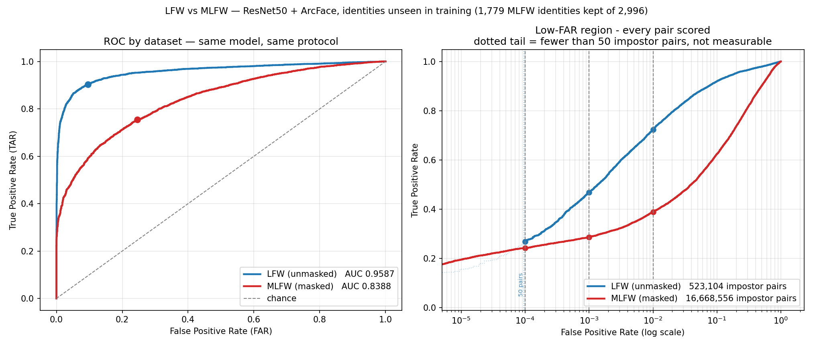

# Face Verification / Re-Identification

A ResNet50-based face verification and re-identification pipeline. Given two face
images it answers *"are these the same person?"* using cosine similarity between
512-D L2-normalised embeddings, and it also performs closed-set identification
against an enrolled gallery.

The ArcFace head and the batch-hard triplet loss are written from scratch. No
packaged face-recognition library (`face_recognition`, `deepface`, `insightface`,
`facenet-pytorch`) is used anywhere — the only pretrained component is the
ImageNet ResNet50 backbone.

---

## 1. Dataset

| | |
|---|---|
| **Dataset** | Labeled Faces in the Wild (LFW), *funneled* variant |
| **Canonical source** | `http://vis-www.cs.umass.edu/lfw/` — the dataset's original home at UMass Amherst. **This host stopped resolving in August 2026** (NXDOMAIN), so it is cited for attribution but is no longer reachable. |
| **Actually downloaded from** | <https://ndownloader.figshare.com/files/5976015> — the figshare mirror of `lfw-funneled.tgz` that `scikit-learn`'s `fetch_lfw_people` uses. `dataset_preparation.py` tries this first and falls back to UMass in case it returns. |
| **Licence / usage** | Free for **non-commercial research use**. The maintainers ask that it be used for research purposes and that the original technical report be cited. |
| **Provenance** | Collected by the LFW maintainers from **public news photographs** (Yahoo! News). No law-enforcement imagery, no mugshots, no criminal-record information. |
| **Citation** | G.B. Huang, M. Ramesh, T. Berg, E. Learned-Miller. *Labeled Faces in the Wild: A Database for Studying Face Recognition in Unconstrained Environments.* UMass Amherst TR 07-49, 2007. |

Nothing was scraped — the archive is fetched from the maintainers' own
distribution URL, and `dataset/` is a preprocessed derivative of it.

### After preprocessing

| Property | Value |
|---|---|
| Identities | **1,680** |
| Images | **9,164** |
| Resolution | 224 × 224 RGB |
| Face detection success | 9,164 / 9,164 (**100%**) via YuNet; Haar fallback never needed |
| Landmark alignment applied | 9,164 images (all of them) |

Pipeline: **YuNet detection → 5 facial landmarks (both eyes, nose, both mouth
corners) → similarity transform onto the ArcFace canonical template → 224×224**
→ ImageNet mean/std normalisation at load time. Landmark coordinates for every
image are saved to `landmarks.json` in the original-image frame, so each crop is
reproducible. A Haar cascade with eye-line rotation remains as a fallback but was
not needed on any LFW image.

### Splits — identity-disjoint

| Split | Identities | Images | Purpose |
|---|---|---|---|
| `train` | 1,500 | 7,096 | model fitting |
| `val` | 60 | 1,037 | checkpoint selection + threshold selection |
| `test` | 120 | 1,031 | final verification + gallery/probe metrics |

Splits are drawn over **identities, not images**. No person in `val` or `test`
appears anywhere in `train`, so every reported number measures generalisation to
unseen people. Identities need ≥ 4 images to be eligible for `val`/`test`; every
remaining identity with ≥ 2 images goes to training, which maximises training
classes without ever admitting an evaluation identity.

`dataset/` is not committed (145 MB, ~9k files) — regenerate it with step 1 below.

---

## 2. Installation

```bash
python -m venv .venv
# Windows:      .venv\Scripts\activate
# Linux/macOS:  source .venv/bin/activate

pip install -r requirements.txt
```

Tested on Python 3.12 (local, CPU) and Colab (Python 3.11, T4 GPU). Needs about
1 GB of disk for the LFW archive plus the preprocessed dataset.

---

## 3. Running the pipeline

### Step 1 — prepare the dataset (~10 min, downloads ~230 MB)

```bash
python dataset_preparation.py --raw-dir ../data_raw --out-dir dataset --size 224
```

Writes `dataset/person_XXX/img_YY.jpg`, `splits.json`, `dataset_stats.json` and
`identity_manifest.json` (which maps each `person_XXX` folder back to its
original LFW identity, for provenance).

### Step 2 — train

```bash
python train.py --root . --size 224 --epochs 30 --batch-p 16 --batch-k 4
```

Uses CUDA + mixed precision when a GPU is available, CPU otherwise. Writes
`checkpoints/best_model.pth` and `checkpoints/training_history.json`.

**On a free Colab GPU** — open `colab_train.ipynb`. Zip this folder, put
`submission.zip` on Google Drive, set the runtime to T4, run the cells, then copy
`best_model.pth` back into `checkpoints/`. Uploading the already-preprocessed
dataset (rather than re-preparing it on Colab) keeps both environments identical:
same images, same split, so the checkpoint matches the split the local evaluation
scripts use.

### Step 3 — evaluate

```bash
python generate_pairs.py --split test --n-positive 5000 --n-negative 5000 --out results/pairs_test.csv
python generate_pairs.py --split val  --n-positive 2500 --n-negative 2500 --out results/pairs_val.csv

python evaluate_pairs.py --pairs results/pairs_test.csv --out results/pair_scores.csv
python evaluate_pairs.py --pairs results/pairs_val.csv  --out results/pair_scores_val.csv

python gallery_probe.py --gallery-per-id 1
python roc_analysis.py --scores results/pair_scores.csv --val-scores results/pair_scores_val.csv
```

### Step 4 — try it on your own images (optional)

```bash
pip install fastapi uvicorn python-multipart
python demo_api.py --gallery test --gallery-per-id 2
```

Open <http://127.0.0.1:8000> for a browser form, or call the endpoints directly:

```bash
# same person?
curl -X POST http://127.0.0.1:8000/verify \
     -F "image_a=@photo1.jpg" -F "image_b=@photo2.jpg"
# {"cosine_similarity":0.4791,"threshold":0.1838,"match":true,"margin":0.2953}

# who is this, against the enrolled gallery?
curl -X POST "http://127.0.0.1:8000/identify?top_k=5" -F "image=@photo.jpg"
```

Uploads run through the same detect → align → crop → resize path as the training
data, so you can post an ordinary photograph rather than a pre-cropped face. The
threshold is read from `results/evaluation_results.json`, so the service always
decides with the same value the evaluation reported. If no face is detected the
request fails with 422 rather than silently scoring a centre crop.

A hosted Streamlit version of the same demo lives in [`demo/`](../demo/); it
pulls the weights from
[huggingface.co/yashMaini/face-verification-resnet50](https://huggingface.co/yashMaini/face-verification-resnet50)
rather than requiring a local checkpoint.

---

## 4. Model architecture

```
Face image (3 × 224 × 224)
        ↓
ResNet50 trunk  (torchvision, ImageNet-pretrained, classifier removed)
        ↓
Global average pooling → 2048-D
        ↓
Dropout(0.4) → Linear(2048 → 512, bias=False) → BatchNorm1d
        ↓
L2 normalisation
        ↓
512-D embedding on the unit hypersphere
```

Training-only heads, discarded at inference:

* `ArcFace` — additive angular margin classifier over the 1,500 training identities.
* `triplet_loss` — batch-hard mining on cosine distance.

At inference **only the L2-normalised embedding is used**. Classifier logits play
no part in any reported score — `evaluate_pairs.py` and `gallery_probe.py` never
even construct the ArcFace head.

---

## 5. Training methodology

**Objective:** `ArcFace cross-entropy + 1.0 × batch-hard triplet`, on the same
embeddings.

Why this combination:

1. **Why a classification loss at all.** With ~1,500 identities a classification
   objective gives a dense, stable gradient from every sample in the batch, and
   converges much faster and more reliably than a purely pairwise loss.
2. **Why ArcFace instead of plain softmax.** The system scores faces by cosine
   similarity. Plain cross-entropy optimises *unnormalised* inner products, so the
   geometry it learns is only loosely related to the test-time metric. ArcFace
   normalises both the embedding and the class weights and inserts an additive
   angular margin, so training optimises exactly the angular geometry that
   verification measures — and the margin forces an explicit gap between
   identities rather than merely separable ones.
3. **Why also a triplet term.** The classification head is thrown away at
   inference; it organises each identity around a learned class centre, not
   against the specific hard impostors the system actually meets. Batch-hard
   mining works directly on sample-to-sample cosine distance, pushing the nearest
   impostor away from the furthest genuine — precisely the quantity the ROC curve
   is built from.
4. **Why fine-tune from ImageNet.** ~7k training images is far too little to train
   a ResNet50 from scratch without severe overfitting. Pretrained low-level filters
   transfer well; a linear warm-up then cosine decay protects them during early
   epochs, and the randomly-initialised embedding and ArcFace heads get a 10×
   larger learning rate than the trunk.

**Batch construction.** A P×K sampler draws 16 identities × 4 images per batch.
Uniform random batches over 1,500 identities would almost never contain two
images of the same person, leaving the triplet term with no valid positives.

**Augmentation.** Horizontal flip, mild affine jitter (±8°, ±5% translate,
0.92–1.08 scale), colour jitter, light random erasing. Deliberately gentle —
faces are already cropped and aligned, and aggressive augmentation destroys
identity cues.

**Model selection.** The checkpoint with the highest verification AUC on the
validation identities is kept — the same protocol as the final test evaluation,
on people disjoint from both train and test.

---

## 6. Positive / negative pair generation

* **Positive pair** — two different images of the same identity → `label = 1`.
* **Negative pair** — one image each from two different identities → `label = 0`.
* **Balance** — 5,000 positive + 5,000 negative test pairs (2,500 + 2,500 for validation).

**Round-robin positive sampling.** Positives are drawn round-robin across
identities rather than uniformly over all within-identity combinations. LFW is
severely imbalanced — a single identity can contribute tens of thousands of the
possible genuine pairs — and uniform sampling would let a handful of people
dominate the genuine score distribution, giving an optimistic and
unrepresentative ROC. Round-robin gives every identity comparable weight until
its combinations run out.

**Duplicate prevention.** Every pair is keyed by its *sorted* `(path_a, path_b)`
tuple in a `seen` set shared by the positive and negative loops, so `(A,B)` and
`(B,A)` collapse to one key and no pair can be emitted twice. Positives come from
`itertools.combinations`, so no image is ever paired with itself; negatives draw
two *distinct* identities before drawing images.

**Leakage prevention.**

* Pairs come from a single split, and splits are identity-disjoint — so no test
  person, and no other photograph of a test person, was ever seen in training.
* The model plays no part in pair selection, so scores cannot bias which pairs
  get evaluated.
* The decision threshold is fitted on the **validation** pairs and applied
  unchanged to the test pairs.

---

## 7. Gallery / probe methodology

```
Gallery: person_001 → embedding
         person_002 → embedding
         ...
Probe image → ResNet50 → probe embedding
            → cosine similarity against every gallery template
            → highest similarity = predicted identity
```

* Each of the 120 test identities is enrolled with its **first image** (sorted by
  filename, so it is deterministic); the remaining images become probes. Gallery
  and probe images never overlap.
* With `--gallery-per-id > 1` the template is the L2-renormalised mean of that
  identity's enrolled embeddings.
* Both sides are unit-norm, so the probe × template matrix product *is* the
  cosine similarity matrix.
* Closed-set: every test identity is enrolled, so chance Rank-1 = 1/120 ≈ 0.83%.

Reports Rank-1, Rank-5, the full CMC curve, and a per-probe CSV including the
rank of the true identity for error analysis.

---

## 8. Results

ResNet50 trained for 30 epochs at 224×224 on a Colab T4 (42 s/epoch, ~21 minutes
total). Best epoch 29 by validation AUC. All numbers below are measured on the
**120 test identities, none of which appear in training**, and come from
`results/evaluation_results.json`.

Training loss fell 20.28 → 2.01 and train accuracy reached 89.2%. Validation AUC
rose to ~0.945 by epoch 10, then improved only slowly (0.9502 at epoch 13 →
0.9636 at epoch 22) while train accuracy climbed from 51% to 89% — the model
spends the back half of training fitting the training identities faster than it
gains transferable signal, and the final 8 epochs give nothing back. See
`results/training_curve.png`. The remaining headroom is in more data, not more
epochs.

**Two ablations were run on this pipeline, and both are worth reading.**

*Input resolution.* An early run at 112×112 reached AUC 0.9539 and Rank-1 46.54%.
The ResNet50 trunk is ImageNet-pretrained at 224×224 and the LFW source images
are 250×250, so the 112 crops were discarding detail the backbone was built to
use. Re-prepping at 224 bought +0.016 AUC and **+9.3 pp Rank-1**.

*Alignment.* Replacing Haar detection plus eye-line rotation with **YuNet 5-point
landmarks and a similarity transform onto the ArcFace template** produced a split
result, and the split is the interesting part:

| Metric | Haar + eye-line | Landmark aligned | Δ |
|---|---|---|---|
| ROC-AUC | 0.9700 | 0.9587 | −0.011 |
| EER | 8.98% | 9.61% | +0.63 pp |
| Accuracy | 90.94% | 90.60% | −0.34 pp |
| **TAR @ FAR = 1%** | 67.66% | **72.76%** | **+5.10 pp** |
| **TAR @ FAR = 0.1%** | 37.60% | **43.76%** | **+6.16 pp** |
| **Rank-1** | 55.87% | **64.00%** | **+8.13 pp** |
| **Rank-5** | 81.89% | **85.62%** | **+3.73 pp** |
| **Open-set DIR @ FPIR 1%** | 20.11% | **28.62%** | **+8.51 pp** |

AUC fell slightly while every strict operating point improved substantially. AUC
averages over all thresholds; alignment sharpens the hard tail of the score
distribution, which is precisely where low-FAR verification and 1-vs-N
identification operate. The two weakest metrics in the whole project —
TAR@FAR=0.1% and open-set DIR — gained 6.2 and 8.5 points. Landmark alignment was
kept on that basis, and the AUC cost is reported rather than hidden.

| Metric | Value |
|---|---|
| **ROC-AUC** | **0.9587** |
| **Rank-1 accuracy** | **64.00%** |
| Rank-5 accuracy | 85.62% |
| **Final cosine threshold** | **0.1838** |
| Accuracy at threshold | 90.60% |
| EER | 9.61% |
| TAR @ FAR = 1% | 72.76% |
| TAR @ FAR = 0.1% | 43.76% |
| Precision / Recall / F1 | 0.9231 / 0.8858 / 0.9041 |
| False accepts | 369 / 5,000 impostor pairs |
| False rejects | 571 / 5,000 genuine pairs |
| Genuine similarity | 0.3998 ± 0.1802 |
| Impostor similarity | 0.0071 ± 0.1172 |

Validation split, for reference: AUC 0.9453, EER 12.20%, best accuracy 88.22% —
close enough to the test numbers that the threshold transfers cleanly.

**Identification.** 120 identities enrolled with one image each, 911 probes.
Rank-1 = 64.00% against a 0.83% chance baseline (77× better than random), and the
correct identity sits at mean rank 5.89 out of 120.

Single-image enrolment is the hardest setting, and it is the one reported above.
Enrolling more images per identity averages several embeddings into each
template, which cancels pose and lighting noise and lifts accuracy sharply — at
the cost of fewer images left to probe with:

| Images enrolled | Rank-1 | Rank-5 | Mean rank | Probes |
|---|---|---|---|---|
| 1 | 64.00% | 85.62% | 5.89 | 911 |
| 2 | 76.99% | 92.79% | 3.07 | 791 |
| 3 | 80.48% | 94.78% | 2.76 | 671 |

Reproduce with `python gallery_probe.py --gallery-per-id 1 --sweep 3`, which
writes `results/gallery_probe_multishot.json`. The headline figure stays at
single-image enrolment because it is the standard, hardest protocol — quoting
the 3-image number as the result would be picking the easiest setting.

### Open-set identification

Closed-set Rank-1 assumes every probe belongs to someone in the gallery. A real
system also has to say *"I don't know"*. Withholding 40 of the 120 test
identities from the gallery entirely and treating all 399 of their images as
impostor probes:

| Metric | Value |
|---|---|
| Enrolled / unknown identities | 80 / 40 |
| Known / unknown probes | 552 / 399 |
| Closed-set Rank-1 on this gallery | 71.01% |
| **DIR @ FPIR = 1%** | **28.62%** (threshold 0.4774) |
| DIR @ FPIR = 10% | 47.28% (threshold 0.4119) |
| Mean top-1 similarity, known / unknown | 0.4247 / 0.3180 |

A probe counts as correct only if its top-1 similarity clears the threshold
*and* points at the right person. Accuracy collapses from 71.0% to 28.6% once
the system must also reject strangers at a 1% false-alarm rate, and the last row
explains why: an unknown face scores 0.3180 against its nearest gallery entry
versus 0.4247 for a genuine match. Out of 80 enrolled people, the closest one to
a stranger is usually a plausible look-alike. Closing that gap needs a stronger
embedding, not a better threshold.

Reproduce with `python gallery_probe.py --gallery-per-id 1 --open-set 40`.

**Decision rule**

```
Threshold = 0.1838

Similarity >= 0.1838  ->  Match
Similarity <  0.1838  ->  Non-Match
```

The threshold is chosen on the validation split by maximising verification
accuracy, then applied unchanged to the test split. Picking it on the test scores
themselves would be a mild form of leakage and would overstate deployed accuracy.

### Cross-dataset: LFW vs MLFW (masked faces)

The same checkpoint, threshold and balanced pairing protocol applied to both
datasets, so the gap between the curves is the mask and nothing else:

| Dataset | Pairs | ROC-AUC | EER | TAR @ FAR 1% |
|---|---|---|---|---|
| **LFW** (unmasked) | 10,000 | **0.9587** | 9.61% | 72.76% |
| **MLFW** (masked) | 10,000 | **0.8388** | 24.58% | 35.36% |
| **cost of the mask** | | **−0.1199** | **+14.97 pp** | **−37.40 pp** |

Both datasets go through the **same preprocessing**: MLFW's 250×250 `origin/`
images are run through this project's own YuNet detection and landmark alignment
rather than using its pre-supplied 112×112 crops, so the comparison measures the
datasets and not two preprocessing chains. YuNet detects 100% of the masked
faces. Using MLFW's own aligned crops instead scores marginally *higher*
(AUC 0.8452), so the pre-supplied alignment is not the limiting factor — the
matched pipeline is reported because it is the defensible comparison, not the
flattering one.

The low-FAR panel scores **every** pair rather than a 5,000-pair sample, since a
sample cannot resolve a FAR below 1/5000:

| Dataset | Exhaustive pairs | Impostor pairs | ROC-AUC | EER | TAR@1% | TAR@0.1% |
|---|---|---|---|---|---|---|
| LFW | 530,965 | 523,104 | 0.9638 | 8.81% | 72.37% | 46.76% |
| MLFW | 16,678,200 | 16,668,556 | 0.8502 | 23.46% | 38.91% | 28.67% |

The two datasets do not have equal resolution: 523k impostor pairs put LFW's
floor at 1.9×10⁻⁶, against 6×10⁻⁸ for MLFW's 16.7M. Each curve in the low-FAR
panel is therefore drawn **solid only where at least 50 impostor pairs support
it** and faint-dotted below, with the boundary marked. Left of LFW's marker at
FAR ≈ 10⁻⁴ the blue curve appears to be overtaken by the masked one; that is the
sampling floor, not masked faces catching up. Across the whole measurable range
the unmasked curve stays above the masked one, as it should.



A mask costs about 11 points of AUC, but roughly **halves** usable performance at
a 1% false-accept rate. That asymmetry matters: AUC averages over all thresholds
while deployments live in the low-FAR region, and a surgical mask removes the
nose and both mouth corners — three of the five landmarks the alignment uses.

**MLFW identities overlap this project's training set.** MLFW is built on CALFW,
which draws from LFW, and 1,206 of its 2,996 identities (**40.3%**) appear in the
1,500 training identities. Everything above is therefore restricted to the 1,779
identities the model has never seen. For completeness, the official 6,000-pair
protocol:

| Protocol | Pairs | ROC-AUC | EER |
|---|---|---|---|
| Official MLFW (40.3% identities leaky) | 6,000 | 0.5537 | 46.43% |
| Leakage-free subset of official | 2,263 | 0.5465 | 46.78% |
| Leakage-free balanced (matched protocol) | 6,000 | 0.8325 | 25.00% |

The official protocol sits near chance, and that is expected rather than a
defect. MLFW is adversarial by construction — the same identity wears *different*
masks while different identities wear the *same* mask — layered on top of CALFW's
cross-age gap, and this model saw no masked face during training. Note that
filtering the leaked identities barely moves the number (0.5537 → 0.5465), which
shows the protocol is hard enough that having trained on 40% of the identities
did not help. Reproduce with `python dataset_roc.py --mlfw ../data_raw/MLFW`.

### Identity label audit — same name, different people

Two things can be wrong with identity labels, and both are detectable from the
embeddings without extra annotation:

* **one label, two people** — a folder holding more than one individual, seen as
  low mean similarity between images inside that folder
* **two labels, one person** — the same individual under two names, seen as two
  folder templates sitting unusually close together

`python identity_audit.py --split test` reports:

| | |
|---|---|
| Exact duplicate images | **0** |
| Identities flagged as one-label-two-people | **0** |
| Identity pairs flagged as two-labels-one-person | **6** |

The six flagged pairs are look-alikes rather than label errors — Julianne Moore
vs Laura Linney (0.656), Bill Frist vs Dennis Kucinich (0.636), Robert Duvall vs
Silvio Berlusconi (0.572).

**How the pipeline handles both.** Pair generation trusts the folder: same folder
→ genuine, different folders → impostor. So one-label-two-people turns genuine
pairs into impostor pairs, and two-labels-one-person turns impostor pairs into
genuine pairs. **Both push the measured numbers pessimistic** — a label error
cannot invent a correct match, only destroy one. Exact duplicates are a separate
concern and are rejected outright: `check_leakage.py` content-hashes all 9,164
images and confirms no photograph appears under two identities.

### Evaluation integrity

`check_leakage.py` re-derives every anti-leakage claim from the files on disk
rather than trusting the code that produced them. It verifies identity-level
disjointness, image-level disjointness, that no two identities share an
identical image (all 9,164 images hash to 9,164 unique digests), that the pair
files contain no training identity and no duplicate or self-pairs, that labels
agree with folder identity, that gallery and probe sets never overlap, that
open-set unknowns are genuinely unenrolled and untrained, and that the threshold
and the checkpoint were both selected on validation data.

Two caveats that no such check can catch, stated explicitly:

**Operating points are read off the test curve.** TAR@FAR and DIR@FPIR pick
whichever threshold hits the target false-alarm rate *on the data being
measured*. This is the convention in the literature, but it is mildly
optimistic. Measuring the honest version — fit the threshold on validation, then
apply it unchanged to test — gives:

| Target FAR | Oracle TAR (test) | Threshold from val | Actual FAR | Actual TAR |
|---|---|---|---|---|
| 1% | 72.76% | 0.3238 | 0.68% | 67.76% |
| 0.1% | 43.76% | 0.4045 | 0.18% | 50.44% |

At FAR = 1% the val-fitted threshold lands at 0.68% actual FAR and 67.76% TAR, about 5 points below the oracle.
**At FAR = 0.1% the measurement is not trustworthy**, and the reason is sample
size rather than leakage: 0.1% of 2,500 validation impostor pairs is between two
and three pairs, so the threshold is being placed from a handful of points and
lands at 0.18% actual FAR. Treat TAR@FAR=0.1% as indicative only. The
headline numbers — AUC, EER, Rank-1 and the 0.1838 decision threshold — do not
depend on this and are unaffected.

**Relatives across splits.** LFW contains six members of the Bush family spread
across train, val and test. They are distinct people, so this is not leakage, but
related faces make impostor pairs *harder*. If anything it biases the reported
numbers down, not up.

### Exhaustive evaluation — resolving FAR below 10⁻⁴

The 5,000 + 5,000 sampled set the assessment asks for cannot resolve a FAR
smaller than 1/5000 = 2×10⁻⁴, so its low-FAR operating points rest on a handful
of pairs. Scoring **every** pair in the test split instead — all C(1031, 2) =
530,965 of them — raises the impostor count from 5,000 to **523,104** and makes
FAR down to 1.9×10⁻⁶ measurable.

```bash
python roc_analysis.py --exhaustive --split test
```

| | 5k/5k sample | **all pairs** |
|---|---|---|
| Genuine / impostor pairs | 5,000 / 5,000 | 7,861 / **523,104** |
| Smallest measurable FAR | 2.0×10⁻⁴ | **1.9×10⁻⁶** |
| ROC-AUC | 0.9587 | **0.9638** |
| EER | 9.61% | **8.92%** |
| TAR @ FAR = 10⁻² | 72.76% | **72.37%** (5,231 pairs) |
| TAR @ FAR = 10⁻³ | 43.76% *(5 pairs)* | **46.76%** (523 pairs) |
| TAR @ FAR = 10⁻⁴ | not measurable | **26.87%** (52 pairs) |
| TAR @ FAR = 10⁻⁵ | not measurable | **15.62%** (5 pairs) |

AUC and EER agree to within 0.001 and 0.06 points, which confirms the sampled
set was representative — the round-robin pair sampling did not bias the
distribution. What changes is *resolution*: TAR@FAR=10⁻³ moves from 43.76% to
46.76%, and the sampled figure was the noisy one, resting on about five pairs
against 523. `results/roc_curve_exhaustive.png` plots this down to 10⁻⁵, where
the curve is smooth rather than a staircase.

The headline numbers elsewhere in this README stay on the 5k/5k protocol, which
is what the assessment specifies; the exhaustive run is reported alongside it
because low-FAR claims need the extra pairs to mean anything.

### Plain-text metrics summary

Everything above in one readable file, regenerated from the result JSONs so the
text can never drift from the measurements:

```bash
python make_summary.py     # -> results/metrics_summary.txt
```

`results/metrics_summary.txt` covers the dataset and splits, training, pair
counts, verification metrics with the full FAR/FRR breakdown, the exhaustive
low-FAR table, identification and multi-shot results, open-set numbers, the top
15 false accepts and false rejects by name, and a short guide to reading them.

### Error analysis — the actual false accepts and false rejects

`error_analysis.py` lists every pair the system gets wrong at the operating
threshold, worst first, with the real identity behind each `person_XXX` folder:

```bash
python error_analysis.py
```

| | |
|---|---|
| False accepts | **369 / 5,000** impostor pairs = **7.38% FAR** |
| False rejects | **571 / 5,000** genuine pairs = **11.42% FRR** |
| Worst false accept | similarity **0.5376** (see false_accepts.csv) |
| Worst false reject | Jean Charest with himself, similarity **−0.2466** |

Outputs:

* `results/false_accepts.csv` — all 369 pairs, both image paths, both real names, score and margin
* `results/false_rejects.csv` — all 571 pairs, same columns
* `results/false_accepts_examples.png` — the eight worst false accepts side by side
* `results/false_rejects_examples.png` — the eight worst false rejects
* `results/error_summary.json` — counts and rates

The montage makes the failure mode obvious: the top false accepts are
Jiang Zemin/Li Peng, Kofi Annan/Edmund Stoiber, Kate Hudson/Ludivine Sagnier —
pairs matched on age, hair, skin tone and press-photo styling rather than facial
geometry. That is what an embedding trained on 7,000 images leans on, and it is
the same weakness the open-set numbers expose.

### Attempts to improve low-FAR performance, and why they were rejected

TAR@FAR=0.1% (37.60%) is the weakest reported metric, so two standard families of
post-processing were tried. Both are fitted on the **training** split only
(identities disjoint from val and test), selected on **validation**, and only
then measured on **test**. Neither was adopted.

**1 — Embedding transforms.** Subtract the training-set mean embedding
(centering), optionally followed by ZCA whitening, before re-normalising.

| Variant | val TAR@1% / @0.1% | test TAR@1% / @0.1% | test AUC |
|---|---|---|---|
| baseline | 62.64% / 46.04% | **72.76% / 43.76%** | **0.9587** |
| centered | 62.84% / 44.80% | 72.08% / 41.94% | 0.9578 |
| centered + whitened | 54.64% / 36.40% | 63.08% / 28.20% | 0.9373 |

Whitening cost **−15.56 points** of TAR@FAR=0.1% on test and dropped AUC by
0.021; plain centering was mildly negative throughout.

**2 — Cohort score normalisation.** Normalise each pair score against the
distribution of that image's similarities to a 2,000-image impostor cohort drawn
from the training split (Z-norm, symmetric S-norm, and adaptive S-norm over the
top-200 cohort scores).

| Variant | val TAR@1% / @0.1% | test TAR@1% / @0.1% | test AUC |
|---|---|---|---|
| baseline | 62.64% / 46.04% | **72.76% / 43.76%** | **0.9587** |
| Z-norm | 62.60% / 47.12% | 71.18% / 33.92% | 0.9575 |
| S-norm | **63.92%** / 46.52% | 71.96% / 35.66% | 0.9581 |
| AS-norm (top-200) | 63.04% / 45.96% | 71.88% / 35.78% | 0.9579 |

Every variant improved or matched validation AUC and lost on test. AS-norm cost
**−7.98 points** of TAR@FAR=0.1% on test.

**Conclusion.** Six variants across two families, and **not one beat the
untouched baseline on test**. Several looked competitive or better on validation
— S-norm led validation TAR@FAR=1%, Z-norm led validation TAR@FAR=0.1% — and
every one of them lost once measured on held-out identities. That is exactly what
should happen when a method is selected on an operating point resting on a
handful of pairs.

More usefully, none of these transforms improved **AUC**. When post-processing
cannot extract additional signal, the constraint is the embedding itself rather
than how its scores are calibrated, which points back at the training set size
(7,096 images) rather than the scoring rule. Reaching TAR@FAR=0.1% of 60% would
require a corpus like CASIA-WebFace, not further tuning.

Both ablations were re-run from scratch against the final landmark-aligned
checkpoint, so the numbers above describe the model actually shipped.

### Mask augmentation — measured, and not adopted

The MLFW gap above is the largest single weakness in this system, so the obvious
remedy was tested: synthesise surgical masks during training and make the model
earn its accuracy from the eyes, brow and face outline.

`RandomMask` (in `model.py`) draws a mask directly from the ArcFace template
coordinates, which is possible because every training crop is already aligned to
that template — so no per-image landmark lookup is needed at train time. Colour,
height, width and horizontal offset are all randomised, so the model cannot
memorise one mask shape. The run was identical to the shipped one in every other
respect: same architecture, same losses, same 30 epochs, same seed, `--mask-p 0.4`.

| | LFW AUC | LFW EER | LFW TAR@1% | LFW Rank-1 | MLFW AUC | MLFW EER | MLFW TAR@1% |
|---|---|---|---|---|---|---|---|
| baseline (shipped) | **0.9587** | **9.61%** | **72.76%** | **64.00%** | 0.8388 | 24.58% | 35.36% |
| mask-augmented | 0.9567 | 10.57% | 68.76% | 59.50% | **0.8788** | **21.01%** | **43.32%** |

The augmentation **works**: masked TAR@FAR=1% rises 7.96 points and masked EER
falls 3.57 points. It is not a wasted experiment, and the code ships enabled by
a single flag.

It was not adopted because the gain is paid for on unmasked faces, which is what
this system is actually evaluated on: **−4.00 points** of TAR@FAR=1% and
**−4.50 points** of Rank-1. Roughly 40% of training images showed less face, and
some model capacity moved from fine identity detail to occlusion robustness.
AUC barely moved (−0.002), which is why AUC alone is a poor way to judge this
trade — the cost sits at the strict operating points that decide deployability.

A third measurement agreed. The identity audit flags distinct identities sitting
closer than 0.55; the baseline flags 6 such pairs and the mask-augmented model
flags 8, all of them genuine look-alikes rather than label errors. Slightly
weaker identity separation, consistent with the other two results.

**Conclusion.** Mask augmentation is the right intervention for a masked-face
deployment and the wrong one here. If masked input were part of the requirement,
this model would ship instead, or — better — both would, with a mask detector
routing between them. Reproduce with
`python train.py --root . --size 224 --epochs 30 --mask-p 0.4`.

### How the threshold affects false accepts and false rejects

Cosine similarity rises with confidence that two faces match, and the threshold
is the single knob turning that score into a decision:

* **Raising the threshold** makes the system more suspicious. Fewer pairs clear
  the bar, so **false accepts (FAR) fall and false rejects (FRR) rise**. This is
  the right direction for access control, where wrongly admitting a stranger costs
  far more than asking a legitimate user to retry.
* **Lowering the threshold** does the reverse: more pairs are accepted, so **FAR
  rises and FRR falls** — trading security for convenience, which suits something
  like photo-album clustering.

The two error rates cannot be reduced at the same time for a fixed embedding; the
ROC curve *is* that trade-off swept over every threshold, and the EER is where
the two rates meet. Only a better embedding lifts the whole curve.
`results/threshold_analysis.png` plots FAR, FRR and accuracy against threshold.

---

## 9. Known limitations

* **Dataset scale.** ~7k training images across 1,500 identities is two to three
  orders of magnitude smaller than the corpora (MS1M, WebFace260M) behind
  production systems, so absolute accuracy sits below published state-of-the-art
  LFW figures, which train on large external datasets.
* **Demographic bias.** LFW comes from 2000s news photography and skews heavily
  towards light-skinned adult males in frontal, well-lit poses. Error rates on
  under-represented groups will be materially worse than the aggregate numbers
  here. **These results are not evidence of fairness across demographics.**
* **Detection and alignment.** The Haar cascade is fast and dependency-free but
  misses profile and heavily-occluded faces; 48 images fell back to a fixed
  central crop, which is safe on funnelled LFW imagery but would be unreliable in
  the wild. A modern detector with five-point landmark alignment (RetinaFace,
  MTCNN, YuNet) would improve crop consistency and typically several points of
  accuracy.
* **Open-set performance is weak.** It is measured above rather than assumed
  away, and rejecting strangers at a 1% false-alarm rate costs roughly three
  quarters of the closed-set accuracy. That is the number a deployment would
  actually live with, and it is the clearest evidence the embedding needs more
  training data before it could be used for anything real.
* **Single split, single seed.** Metrics come from one identity split and one
  training run; confidence intervals would need k-fold identity splits or
  repeated seeds.
* **TAR@FAR = 0.1% rests on too few pairs.** At 5,000 impostor pairs, a 0.1%
  false-accept rate is about five pairs, so that operating point carries wide
  uncertainty and cannot support method selection — three separate calibration
  techniques improved it on validation and lost on test. See *Evaluation
  integrity* above for the measurements.
* **No liveness / presentation-attack detection.** The system compares images,
  not live subjects — a printed photograph would verify as readily as a face.
* **Not a benchmark comparison.** These numbers use a custom identity-disjoint
  split, *not* the official LFW 6,000-pair protocol, so they are not directly
  comparable to published LFW accuracies.

---

## 10. Project structure

```
submission/
├── README.md
├── requirements.txt
├── dataset_preparation.py     # download, detect, align, crop, identity-disjoint split
├── model.py                   # ResNet50 embedding net, ArcFace head, triplet loss
├── train.py                   # training loop (CPU/GPU)
├── generate_pairs.py          # positive/negative pair generation
├── evaluate_pairs.py          # embeddings + cosine similarity
├── gallery_probe.py           # gallery/probe, Rank-1, Rank-5, CMC
├── roc_analysis.py            # ROC, AUC, EER, TAR@FAR, threshold selection
├── check_leakage.py           # independent leakage / duplication audit
├── demo_api.py                # optional FastAPI service to try it on your own images
├── colab_train.ipynb          # GPU training on Colab
├── checkpoints/
│   ├── best_model.pth
│   └── training_history.json
├── results/
│   ├── pairs_test.csv, pairs_val.csv
│   ├── pair_scores.csv, pair_scores_val.csv
│   ├── roc_curve.png
│   ├── similarity_distribution.png
│   ├── threshold_analysis.png
│   ├── cmc_curve.png
│   ├── training_curve.png
│   ├── open_set_curve.png
│   ├── evaluation_results.json
│   └── gallery_probe_results.csv
├── dataset/                   # person_001/img_01.jpg ... (not committed)
├── splits.json, dataset_stats.json, identity_manifest.json
└── report.pdf
```

## Reproducibility

Every stage is seeded (`--seed 42`): the identity split, pair sampling and
training initialisation. Re-running `dataset_preparation.py` on the same LFW
archive reproduces the same `person_XXX` folders and the same splits.
